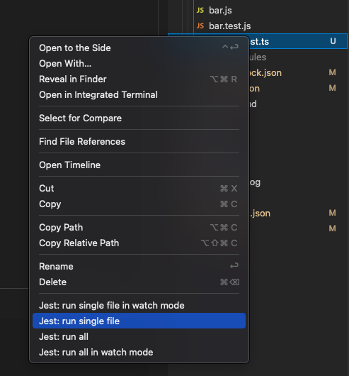
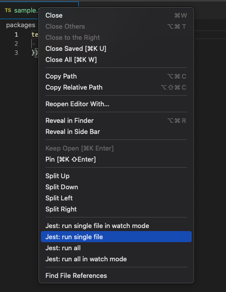

# Jest Context Menu Runner

Enchance Sidebar file explorer and Editor file tab context menus with Jest commands to run a single test or all tests in a project.
Additional menu options are visible only for .test._ and .spec._ files. Extension [source code](https://github.com/buberdds/vs-jest-context-menu-runner) is available on Github.

## Requirements

The extension has been built and tested in VSCode 1.32.3, Node.js: 10.2.0, Windows_NT x64. When encounter bugs please post them in GitHub repository [issues](https://github.com/DevelAx/Daddy-Jest/issues).
